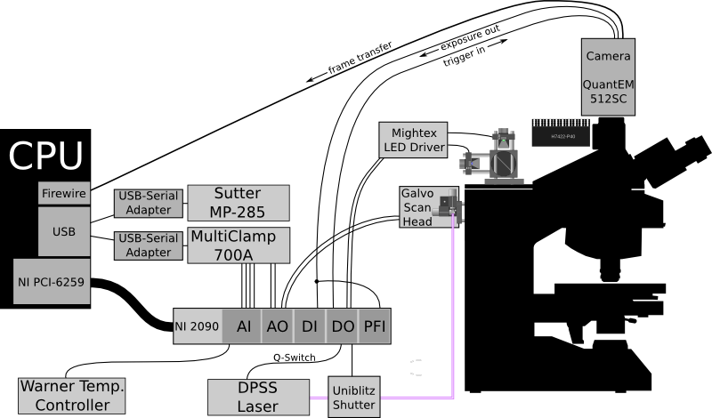

Hardware Configuration
======================

It is ultimately up to the experimenter to understand their hardware and decide how best to configure it. For the most part, deciding on a hardware configuration will depend on 1) the capabilities required by the experimenter and 2) the limitations of the hardware. Wherever possible, we have avoided imposing any unnecessary limitations through the software (although there are a few). Below is an example setup which makes use of most of the current capabilities in ACQ4.

    Example hardware configuration.
    
    This setup includes:
        
    #. DAQ (NI 6259) which communicates with and synchronizes most of the hardware
    #. Two-channel MultiClamp
    #. Camera (Photometrics QuantEM 512) with trigger input and exposure output connected to DIO lines on the DAQ
    #. Sutter MP-285 for reading the position of the microscope stage
    #. Scanning galvometric mirrors controlled by DAQ analog output
    #. Laser controlled by two DO lines: one to activate the Q-switch, and one to open a shutter
    #. Digitally controlled LEDs for fluorescence imaging
    #. Temperature recording from a Warner controller

MultiClamp 700A/B
-----------------

ACQ4 records data and outputs stimuli to the MultiClamp channels via the DAQ. At the same time, the state of the MultiClamp is controlled and recorded via serial or USB interface and the "Commander" software supplied by Molecular Devices. In a typical configuration, each channel of the MultiClamp will use one analog output and two analog inputs on the DAQ board, but each of these connections is optional.

Cameras
-------

At a minimum, cameras will connect to the CPU via firewire, USB, frame grabber, etc. This will allow basic use of the camera for displaying and recording images/video. More complex behavior will usually require the camera to be synchronized with the DAQ. This can be accomplished in two different ways:

#. The DAQ triggers the camera, telling it when to record frames. This is only possible with cameras that have a TTL trigger input to be driven by a digital output port on the DAQ.
#. The camera triggers the DAQ, telling it when to start recording. This is only possible if the camera has a TTL output indicating that it has started acquiring frames. Most scientific cameras will at least have an output which indicates when frames are being acquired, which is sufficient for this purpose. This line should be connected to one of the PFI inputs on the DAQ to allow triggering.
    
That takes care of starting the DAQ and camera simultaneously. In addition, we ideally want to know the exact time that each frame is acquired so they can be aligned correctly with other signals recorded on the DAQ. To accomplish this, the camera's exposure TTL output must be connected to a buffered input on the DAQ board (digital input is recommended, but E-series boards do not have buffered digital I/O, so analog input would be required there). During synchronized acquisition, each camera frame will be automatically tagged with the exact time it was acquired.

Note: In the diagram above the exposure TTL signal is connected to both PFI and DI lines on the DAQ. Depending on your camera, this can cause trouble because if the PFI line is not in use, it goes into a low-impedance state which may prevent the exposure signal being recorded correctly on the DI line. Solutions to this are 1) disconnect the PFI line when it is not in use, 2) always make sure the PFI line is in use by requiring that the camera trigger the DAQ, or 3) add some electronics in between to properly isolate the two input lines.

Stage Position Control
----------------------

Currently there is no way to *control* the position of a Sutter MP-285 stage via ACQ4 (but this is coming soon). It is possible to read the stage position, but with one caveat: the MP-285 is often controlled by a 2 or 3-axis wheel input device. If the computer attempts to read the controller position at the same time the wheel input is in use, it will crash the controller. This is a limitation of the MP-285 which can be worked around, but you will have to contact Sutter for more information. We are currently looking for better solutions (also coming soon).

Another option exists for the intrepid-adventurer type (or for those looking for less expensive options). Many electrophysiology stages are controlled by manual micromanipulators. It is possible to read the position of the stage by attaching some variety of rotary encoder to the micromanipulators. A simple option is to use the hardware from a serial mouse to accomplish this task, and ACQ4 will support the use of serial mice as positioning devices. Similarly, an arduino board fitted with rotary encoders could be programmed to output serial mouse protocol.

